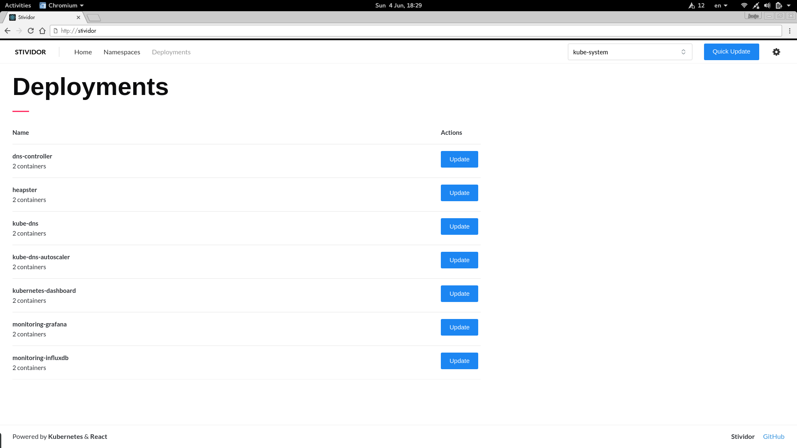

Stividor
========

Stividor is an opinionated tool for managing deployments in Kubernetes. It links directly with the Kubernetes API, and
is intended to be used as a basic deployment tool, instead of the official Dashboard.

## Contributing

Contributions are welcome to the project - whether they are feature requests, improvements or bug fixes! Refer to
[CONTRIBUTING.md](CONTRIBUTING.md) for our contribution requirements.

## License

This tool is released under the [MIT License](http://opensource.org/licenses/mit-license.php).